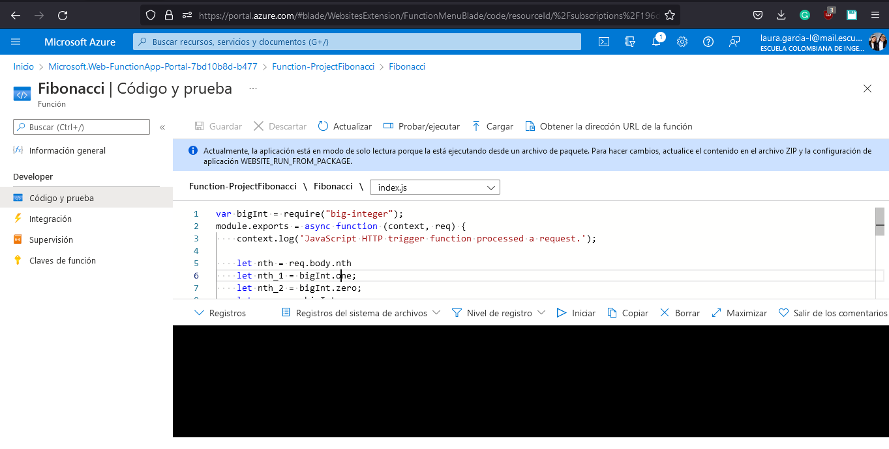
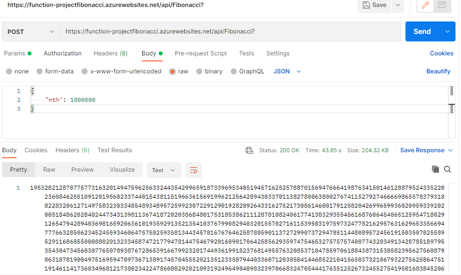
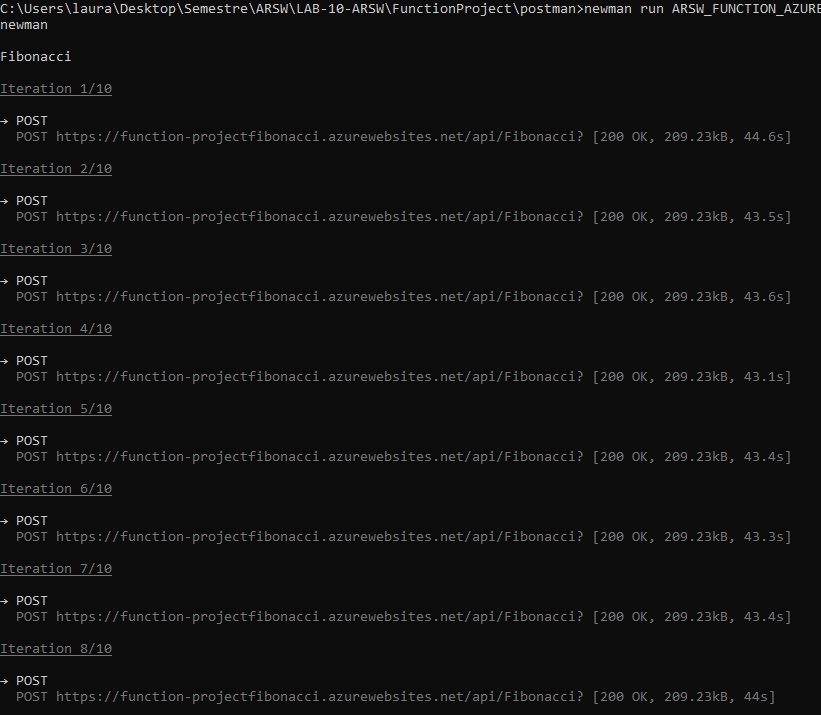
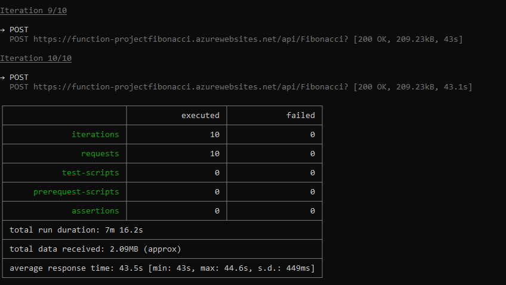

### Escuela Colombiana de Ingeniería
### Arquitecturas de Software - ARSW

## Escalamiento en Azure con Maquinas Virtuales, Sacale Sets y Service Plans

### Dependencias
* Cree una cuenta gratuita dentro de Azure. Para hacerlo puede guiarse de esta [documentación](https://azure.microsoft.com/es-es/free/students/). Al hacerlo usted contará con $100 USD para gastar durante 12 meses.
Antes de iniciar con el laboratorio, revise la siguiente documentación sobre las [Azure Functions](https://www.c-sharpcorner.com/article/an-overview-of-azure-functions/)

### Parte 0 - Entendiendo el escenario de calidad

Adjunto a este laboratorio usted podrá encontrar una aplicación totalmente desarrollada que tiene como objetivo calcular el enésimo valor de la secuencia de Fibonnaci.

**Escalabilidad**
Cuando un conjunto de usuarios consulta un enésimo número (superior a 1000000) de la secuencia de Fibonacci de forma concurrente y el sistema se encuentra bajo condiciones normales de operación, todas las peticiones deben ser respondidas y el consumo de CPU del sistema no puede superar el 70%.

### Escalabilidad Serverless (Functions)

1. Cree una Function App tal cual como se muestra en las  imagenes.

2. Instale la extensión de **Azure Functions** para Visual Studio Code.

3. Despliegue la Function de Fibonacci a Azure usando Visual Studio Code. La primera vez que lo haga se le va a pedir autenticarse, siga las instrucciones.

## Despliegue de la función 

4. Dirijase al portal de Azure y pruebe la function.

## Prueba de la función 

5. Modifique la coleción de POSTMAN con NEWMAN de tal forma que pueda enviar 10 peticiones concurrentes. Verifique los resultados y presente un informe.

## 10 peticiones

El tiempo promedio que le toma al sistema generar una respuesta a la solicitud es de 43,5 s. Todas las 
peticiones fueron ejecutadas y tuvieron una respuesta positiva, no se generó ningun fallo durante la ejecución de estás. 

6. Cree una nueva Function que resuleva el problema de Fibonacci pero esta vez utilice un enfoque recursivo con memoization. Pruebe la función varias veces, después no haga nada por al menos 5 minutos. Pruebe la función de nuevo con los valores anteriores. ¿Cuál es el comportamiento?.

**Preguntas**

* ¿Qué es un Azure Function?

    Azure Function es una solución que permite escribir pequeños fragmentos de código o funciones en la misma, con el fin de mantener menos infraestrucutra ahoorando costos. Con esto, se centran únicamente en desarrollo de dicho código ya que Azure se encargará de proporcionar todos los recursos que sean necesarios para el funcionamiento de estas. 

* ¿Qué es serverless?

    La computación sin servidor es un modelo de ejecución en el que el proveedor en la nube es responsable de ejecutar un fragmento de código mediante la asignación dinámica de recursos, además de que solo serán facturados los recursos utilizados para ejecutarlo. Generalmente el código será ejecutado dentro de contenedores sin estado que pueden ser activados por distintos que eventos que incluyen solicitudes HTTP, eventos de base de datos, servicios de colas, alertas de monitoreo, carga de archivos, etc. 

* ¿Qué es el runtime y que implica seleccionarlo al momento de crear el Function App?

    Runtime o tiempo de ejecución es el intervalo de tiempo en el que un programa se ejecuta en un sistema operativo. 

    Al utilizar el plan Consumption y la versión de runtime 12, el tiempo asignado de timeout será de 5 minutos, igualmente, la memoria será borrada pasado este tiempo. 

* ¿Por qué es necesario crear un Storage Account de la mano de un Function App?

    Function App se basa en Azure Storage para operaciones como la administración de desencadenadores y el registro de ejecuciones de funciones. 

* ¿Cuáles son los tipos de planes para un Function App?, ¿En qué se diferencias?, mencione ventajas y desventajas de cada uno de ellos.

    * *Consumption*: Ofrece escalabilidad dinámica y facutra solo cuando la aplicación es ejecutada, tiene un timeout de 5 minutos y brinda una memoria máxima de 1.5 GB por instancia, un almacenamiento de 1 GB y 200 instancias como límite. 

    * *Premium*: Ofrece escalabilidad dinámica, se factura por el número de segundos de core y la memoria usada en distintas instancias, puede variar el tiempo de timeout, por instancia la memoria será de 3.5 GB y el almacenamiento hasta de 250 GB, y ofrece un máximo de 100 instancias. 

    * *Dedicated*: El cliente puede implementar manualmente la escalabilidad, puede tener timeouts ilimitados, por instancia la memora es de 1.7GB y una capacidad de almacenamiento hasta de 1000 GB, ofrece un máximo de 20 instancias. 

* ¿Por qué la memoization falla o no funciona de forma correcta?
* ¿Cómo funciona el sistema de facturación de las Function App?
* Informe
